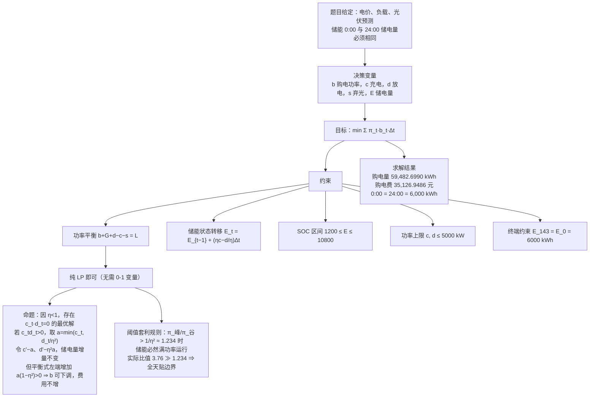
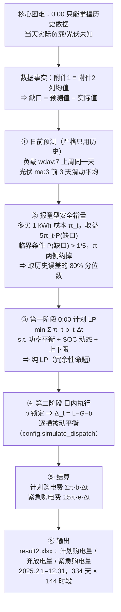
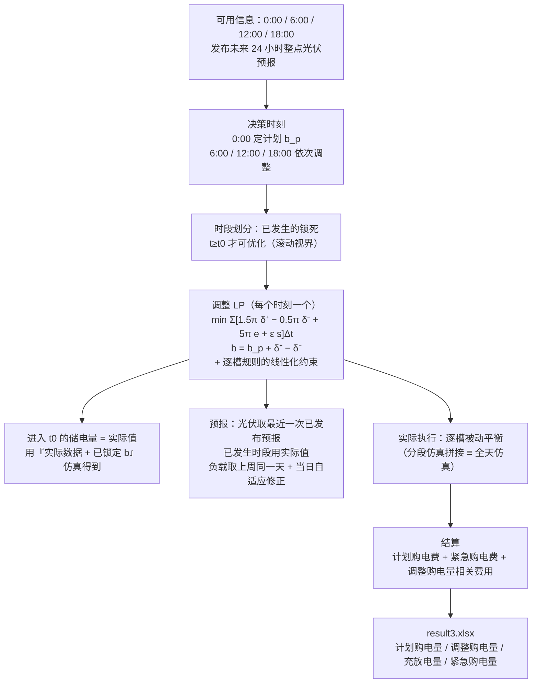

# 模型与口径说明

> 本文档把三问的建模思路、必须坚持的口径、以及所有对照实验的结论集中在一起，
> 论文写作时可直接按小节取用。

---

## 0. 三条核心口径（先看这个）

### 0.1 时间口径

第 $t$ 个时段（$t=0,\ldots,143$）覆盖 $[10t,\;10t+10]$ 分钟，即 $t=0$ 是 0:00–0:10、$t=143$ 是 23:50–24:00。
附件1 的时间戳按**区间右端点**解释（第 1 行 00:10 → $[00{:}00,00{:}10]$，末行 `0:00+1` → 23:50–24:00）。
这样 144 段恰好铺满 $[00{:}00,24{:}00]$。

> 官方模板 `result*.xlsx` 的表头（从 `0:10-0:20` 开始）比数据错位一格，是模板的笔误。
> 处理方式：**只按行序填数**，并在论文中声明本报告采用的口径。

### 0.2 附件3 的预报是「整点瞬时值」

题目说"可获得未来 24 小时**整点**的光伏发电功率预报"。经数据标定确认：
`预报k小时` = 发布后第 $k$ 个**整点时刻的瞬时功率（点值）**，而**不是**该小时的平均功率。

| `预报k小时` 的解释 | 与附件2 实际光伏的逐槽 MAE |
|---|---|
| 整点瞬时值（点值）→ 整点值线性插值到 10 分钟时段 | **191.7 kW** |
| 小时平均功率（区间 $[H-1,H]$ 的均值） | 361.6 kW |

**诊断依据**：按小时均值对齐时，逐小时平均偏差呈"上午正、下午负"的**导数形状**
（8:00 为 $+733$ kW、16:00 为 $-802$ kW），且该偏差约为 $0.5\,\mathrm{d}PV/\mathrm{d}t$ —— 典型的
"点值 vs 区间均值"错位半格的特征。改按点值口径后，逐步槽偏差塌缩到 $\pm100$ kW 以内。
另有滞后检验确认不存在额外的时间平移（$\pm10$ 分钟即显著变差）。

**预报精度对比（逐槽 MAE）**

| 预报源 | MAE (kW) |
|---|---|
| 附件1 基准日曲线（气候态平均） | 460.7 |
| 同星期外推 `wday:7` | 206.1 |
| 持续性 `ma:1` | 182.3 |
| 前 3 天滑动平均 `ma:3` | 152.7 |
| 附件3 @ 0:00 发布（点值口径） | 191.7 |
| **$0.4\times$附件3 $+\,0.6\times$`ma:3`** | **130.6** |

⇒ 单用附件3 反而不如历史外推，但**两者混合后最优**（比单用历史好 14.5%）。问题三采用混合权重 0.4。

### 0.3 储能执行：逐槽被动平衡

购电量 $b$ 一经锁定，每个时段的**储能净动作就被唯一决定**：

$$d_t-c_t-s_t-e_t=\Delta_t,\qquad \Delta_t=L_t-G_t-b_t$$

$$\begin{cases}
\Delta_t>0:\; d_t=\min\bigl(\Delta_t,\;\bar P,\;(E_{t-1}-E_{\min})\eta/\Delta t\bigr),\quad e_t=\Delta_t-d_t \;(紧急购电)\\[2pt]
\Delta_t<0:\; c_t=\min\bigl(-\Delta_t,\;\bar P,\;(E_{\max}-E_{t-1})/(\eta\Delta t)\bigr),\quad s_t=-\Delta_t-c_t \;(弃光)
\end{cases}$$

**性质**：

1. $e_t>0 \iff E_t=E_{\min}$（只要掏紧急购电，电池必然已经见底）；$s_t>0 \iff E_t=E_{\max}$。
2. **无前瞻** ⇒ 每个时段只依赖"当前 SOC + 当前时段数据" ⇒ **全天仿真 ≡ 分段仿真拼接**。
3. 等价于「**严格执行日前储能计划 + 用储能全额吸收预测偏差**」。
4. 它是**给定购电量的最优逐时段响应**（每槽都最大化抑制 $5\pi$ 紧急购电），
   但不做跨时段的储能调度 —— 这一点是后面所有对照实验的关键。
5. 在分时段电价下，**储备电量应对峰段缺口**这件事它不做，因此有约 7% 的代价（见 §3.4）。

实现：`config.simulate_dispatch(L, G, b, E0, t_from=0, t_to=None)`。

---

## 1. 数据标定事实

| 事实 | 证据 |
|---|---|
| 附件1 = 基准日/典型日 | 附件1 负载 $\equiv$ 附件2 列均值（最大绝对差 $5\times10^{-5}$）；光伏（最大绝对差 0.043）；电价 $\equiv$ 附件4 列均值（$5.2\times10^{-5}$） |
| 附件1 的光伏列名是"光伏发电**预测**功率"，附件2 是"光伏发电**实际**功率" | 正好构成"预测 vs 实际" |
| 附件2 | 365 天 $\times$ 144 槽，无缺失；负载 1995.7–7978.9 kW；光伏 0–10216.2 kW |
| 附件3 | 1460 行 = 365 天 $\times$ 4 个发布时刻（0:00/6:00/12:00/18:00），列 `预报1小时`…`预报24小时` |
| 附件4 | 365 $\times$ 145，逐日电价；全局 0.0076–1.7936，均值 0.7662 |
| 附件1 电价 | 0.3713–1.3952，日均 0.7662 |

**分档（按电价 33%/67% 分位）**：谷 $\le0.4424$（48 段 / 8.0 h）、峰 $\ge0.9371$（49 段 / 8.2 h）。
紧急购电单价 $5\pi$：**谷 2.143、平 3.711、峰 5.600 元/kWh**（峰谷比 2.61）。

---

## 2. 问题一：单日 MILP 计划

### 2.1 思维导图



### 2.2 结果

| 项 | 值 |
|---|---|
| 全天计划购电量 | 59,482.6990 kWh |
| 全天购电费 | 35,126.9486 元 |
| 0:00 / 24:00 储电量 | 6,000 / 6,000 kWh |

`q1.py` 与 `storage.py` 两份独立实现结果**完全一致**（互为验证）；`storage.py` 额外输出 10 分钟粒度 SOC。

---

## 3. 问题二：全年 0:00 计划 + 日内执行

### 3.1 思维导图



### 3.1.1 负载周期性的证据（支撑「lag = 7」的预测依据）

图：`figures/q2/fig_负载周周期性.png`（脚本 `q2_periodicity.py`，文字报告 `q2_负载周周期性.txt`）

**周内模式**：全年 365 天按星期分组，低负载日只有 **周五、周六**（日均 3265 kW），
其余五天（周一~周四、周日）日均 5168 kW，**相差 37%**。

> ⚠️ 注意：这份数据的「休息日」是**周五、周六**，不是周末。
> 论文里不要写成「周末用电少」。

**自相关**（逐槽 Pearson 相关，按天平均）：

| 滞后（天） | 1 | 2 | 3 | 4 | 5 | 6 | **7** | 8 | … | **14** |
|---|---|---|---|---|---|---|---|---|---|---|
| 相关系数 $r$ | 0.4344 | −0.1026 | −0.1088 | −0.1152 | −0.1151 | 0.4196 | **0.9528** | 0.4141 | … | **0.9329** |

滞后 2~5 天甚至为**负**相关，而在 7 天倍数处出现尖峰 ⟹ **周期恰为 7 天**。

**离散度**：滞后 1 天的平均绝对偏差 650.6 kW，滞后 7 天只有 **175.8 kW**（接近 4 倍）；
同星期内部的逐槽标准差均值仅 371~378 kW。

**预测精度**（评估区间：第 21 天之后，逐槽 MAE）：

| 方法 | MAE (kW) | 相对持续性 |
|---|---|---|
| 持续性 lag1 | 650.6 | — |
| **上周同一天 lag7** | **175.8** | **−73.0%** |
| lag14 | 208.6 | −67.9% |
| 前3天均值 ma3 | 943.1 | +45.0% |
| 前7天均值 ma7 | 781.5 | +20.1% |
| 附件1 基准日 | 791.5 | +21.7% |

⇒ **lag = 7 比持续性预测（lag1）低 73.0%、比附件1 基准日低 77.8%**，
这就是第二问采用「上周同一天」预测小区负载的依据。

> 对照：光伏的周期性与负载不同 —— 光伏用前 3 天滑动平均 `ma:3` 反而更好
> （见 §0.2 的精度表），所以第二问的预测规格是 `wday:7`（负载）`|` `ma:3`（光伏）。

### 3.2 结果

| 项 | `hedge=0`（无裕量） | **`hedge=300` kW（主方案）** |
|---|---|---|
| 计划购电量 | 20,070,215.3 kWh | 21,795,174.4 kWh |
| 计划购电费 | 12,195,725.6 元 | 13,488,522.9 元 |
| 紧急购电量 | 523,825.4 kWh（2.61%） | **112,059.1 kWh（0.51%）** |
| 紧急购电费 | 3,032,588.7 元（19.9%） | **633,131.1 元（4.5%）** |
| **总购电费** | **15,228,314.3 元** | **14,121,654.0 元** |
| 出现紧急购电的天数 | 309 / 334 天 | **85 / 334 天** |
| 期末（12/31 24:00）储电量 | 1,237.9 kWh | — |

> **安全裕量是当前口径下最大的单一杠杆**：多买 300 kW 使计划购电费上升 129.3 万元，
> 但紧急购电费下降 239.9 万元，**净省 110.7 万元（7.3%）** —— 与问题三的调整机制效果同量级。
> 机理：逐槽规则下储能被动吸收全部偏差、不会主动留余量，一旦电池提前见底，
> 后续缺口全部按 $5\pi$ 结算；必须靠「多买一点」把缺口概率压下去。
> （结论：81 天的紧急购电天数从 309 降到 85。）

### 3.3 储能执行口径对比

| 口径 | 计划购电费 | 紧急购电费 | 合计 | 备注 |
|---|---|---|---|---|
| 储能严格按计划执行（`hedge=300`） | 1,375.1 万 | 139.5 万 | 1,514.6 万 | 偏差全靠紧急购电填 |
| 逐槽被动平衡 · 无裕量 | 1,219.6 万 | 303.3 万 | 1,522.8 万 | 因果、无前瞻、可执行 |
| **逐槽被动平衡 · 裕量 300 kW** | **1,348.9 万** | **63.3 万** | **1,412.2 万** | **主方案** |
| 完全信息最优再调度（`hedge=0` 计划） | 1,223.5 万 | 190.6 万 | 1,414.1 万 | **事后下界，不可执行** |

> 注：上表第 1、4 行取自 `q2_实时再调度对比.txt`，该文件由**较早版本的代码**生成，
> 绝对数值与当前代码有约 0.3% 的差异；要核对请执行 `python q2_rt.py` 重新生成。

### 3.4 主口径与完全信息下界的差距来自哪里（`q2_口径诊断.txt`）

> 下表对**同一个 `hedge=0` 计划**比较两种储能调度方式，因此差距可以干净地归因给「储能时序」，
> 不掺杂计划质量的差异。

| | 逐槽被动平衡 | 完全信息最优 | 差 |
|---|---|---|---|
| 计划购电费 | 12,195,725.6 | 12,234,616.2 | $+38{,}890.6$ |
| 紧急购电量 | 523,825.4 kWh | **566,893.9 kWh** | **$+43{,}068.5$** |
| 紧急购电费 | 3,032,588.7 | **1,906,390.1** | **$-1{,}126{,}198.6$** |
| **总购电费** | **15,228,314.3** | **14,141,006.3** | **$-1{,}087{,}308.0$** |
| 紧急购电量落在峰段 | **84.2%** | 16.1% | |
| 紧急购电费落在峰段 | **91.8%** | 28.0% | |

**关键结论：完全信息最优反而多买了 4.3 万 kWh 紧急电（+8.2%），却省了 112.6 万元。**

差距**全部来自紧急购电的时段选择**，与储能吞吐能力无关：

```
 小时   逐槽法      完全信息最优   5π单价
 0:00      346       16,590      2.13     ← 优解在谷段主动掏紧急购电
 3:00    1,260       15,068      2.18
 5:00    1,329       23,955      2.63
 8:00   32,985          678      5.41
 9:00   50,677        3,296      4.89
11:00      341       83,830      2.36     ← 中午光伏大发、电价低，掏这里最划算
12:00        0       59,275      2.62
18:00    4,931       27,892      6.37
19:00   63,216        9,093      6.74
20:00  256,267       18,843      6.33     ← 逐槽法一小时掏了全年 49% 的紧急电
21:00   24,785       22,669      4.14
```

逐槽法在早上 8:00–10:00（晨间爬坡缺口）就把电池耗光，硬扛到晚间峰段，
于是 20:00 一个小时掏了 256,267 kWh × 6.33 元 = **162.2 万元**，占它全年紧急购电费的 53%。

**这就是"无前瞻"的代价：7.1%。** 论文中把它写成 **完全信息下界（clairvoyant lower bound）**，
用来衡量主口径的改进空间 —— 而问题三的调整机制正好把其中 91% 合法地捞了回来（见 §4.5）。

---

## 4. 问题三：多阶段滚动调整

### 4.1 题目给的费用口径（原文）

> 计划购电量高于调整购电量的部分，违约电价是交易时刻电价的 50%。
> 调整购电量高于计划购电量的部分，超出部分的电价是交易时刻电价的 1.5 倍。

$$C_t=\underbrace{\pi_t\min(b^p_t,b^a_t)}_{\text{计划内部分}}
+0.5\,\pi_t\bigl(b^p_t-b^a_t\bigr)^{+}
+1.5\,\pi_t\bigl(b^a_t-b^p_t\bigr)^{+}$$

**线性化**（$b^a_t=b^p_t+\delta^+_t-\delta^-_t$，$\delta^\pm\ge0$）：

$$C_t=\pi_t b^p_t+1.5\pi_t\delta^+_t-0.5\pi_t\delta^-_t$$

该函数关于 $b^a_t$ 是**凸的分段线性函数**（斜率由 $-0.5\pi$ 跳到 $+1.5\pi$），可直接用 LP 表达。

> ⚠ **注意这个费用结构引出的"少买动机"**：把 $b^a$ 压到 $b^p$ 以下，被取消的那部分只按 $0.5\pi$ 计价，
> 而按计划买要付 $\pi$。所以 LP 有强烈动机少买 → 必须用安全裕量对冲（§4.6）。

### 4.2 逐槽规则在 LP 中的精确嵌入

调整阶段要在 LP 里**预测**储能的执行结果，所以必须把 §0.3 的规则写进约束：

$$d_t-c_t-s_t-e_t=L_t-G_t-b_t$$
$$d_t\le\bar P,\qquad d_t\le(E_{t-1}-E_{\min})\eta/\Delta t$$
$$c_t\le\bar P,\qquad c_t\le(E_{\max}-E_{t-1})/(\eta\Delta t)$$
$$s_t\le G_t,\qquad E_t=E_{t-1}+(\eta c_t-d_t/\eta)\Delta t,\qquad E\in[E_{\min},E_{\max}]$$

目标里 $e_t$ 的系数 $5\pi_t$ 远大于 0、$s_t$ 的系数 $\varepsilon=10^{-6}$ 极小，
于是最优解中 $d_t$、$c_t$ 会自动取到各自上界，**恰为逐槽规则**。
（$c_t d_t=0$ 由 $\eta<1$ 自动成立，无需 0-1 变量。）

**这意味着一次纯 LP 就能精确预测执行结果，不需要 "LP + 仿真" 嵌套迭代。**

### 4.3 一致性验证（`_check3` 类实验的结论）

在 325 天上对比「LP 内部假设的结果」vs「同一条 $b$ + 逐槽规则 + 同一预报」：

| | 紧急购电量 | $t\ge36$ 段费用 |
|---|---|---|
| LP 内部假设 | 0.0 kWh | 7,966,197.9 元 |
| 同 $b$ + 逐槽 + 同一预报 | 0.0 kWh | 7,966,197.9 元 |
| 同 $b$ + 逐槽 + **实际数据** | 389,939.7 kWh | 10,215,428.4 元 |

**分毫不差，325 天里 LP 主动掏紧急购电的天数 = 0。**
⇒ 嵌入是精确的，LP 挑出的 $b$ 与实际执行完全自洽。

### 4.4 为什么问题三必须用逐槽法

**严格说不是题目要求** —— 题目第三问的决策变量只有购电量 $\{b^p_t\},\{b^a_t\}$，储能怎么动由模型定义。

**真正"必须"的是这条自洽性要求：**

> 调整 LP 里假设的「未来储能行为」，必须与实际执行时的储能行为一致，
> 否则 LP 挑出的 $b$ 是**为错误模型优化的**。

逐槽法满足它，靠三个性质：

1. **可被 LP 精确刻画**（§4.3 已验证）→ 无嵌套迭代，一次 LP 解决。
   若改用"完全信息最优"或"滚动 MPC"当执行规则，调整问题就变成双层嵌套优化，只能反复仿真逼近。
2. **无前瞻的确定性规则** → 全天仿真 $\equiv$ 分段仿真拼接。
   多阶段滚动必须做到"6:00 只改 $t\ge36$、12:00 只改 $t\ge72$……"，
   用未来信息改过去是禁止的，而这条性质保证了过去的决策不会被未来的决策污染。
3. **让 Q2 → Q3 的收益可干净归因**：执行层完全固定，两问唯一的差别就是"$b$ 能不能被调整"。

**代价**：放弃"利用已知电价主动挑选紧急购电时段"的能力。在 `hedge=0` 计划下这个代价是 7.1%（§3.4）。
这个代价在论文里是**优点而非缺点** —— 它给出了一个上界对照，说明"改进空间在哪里"；
而两块**同样只依赖因果信息**的机制把它基本填平了：

| 机制 | 额外节省 | 是否需要预知未来 |
|---|---|---|
| 报童型安全裕量（问题二就能用） | 110.7 万元 | 否，仅用历史误差分布 |
| 题目要求的多阶段预报更新（问题三） | 27.5 万元 | 否，仅用已发布预报 + 已发生实际值 |

两者**部分互补**，所以叠加收益小于各自的单独数额。

> 另注：**加密决策时刻反而更差**（§4.6 表）。因为每次调整都要付 $0.5\pi/1.5\pi$ 的偏离费，
> 而没有新预报信息时，多调整只会让 $b$ "过度拟合"错误的预测。

### 4.5 思维导图



### 4.6 结果与参数寻优

**全年结果（2025.2.1–12.31，334 天；`mix=0.4, hedge=300, adapt=0.2`）**

| 项 | 值 |
|---|---|
| 计划购电量 | 21,870,649.6 kWh |
| 调整后购电量 | 21,920,930.9 kWh（净 $+50{,}281.3$） |
| 计划购电费 | 13,529,286.4 元 |
| 调整相关购电费（含计划部分） | 13,675,006.3 元（$+145{,}719.9$） |
| 紧急购电量 | 34,077.2 kWh（占调整后购电量 0.16%） |
| 紧急购电费 | 172,468.8 元 |
| **总购电费** | **13,847,475.1 元** |
| 充电 / 放电 / 弃光 | 6,151,470.9 / 4,983,363.0 / 2,847,710.7 kWh |
| 出现紧急购电 / 发生调整的天数 | 75/334、334/334 天 |

**相对问题二（同为 `hedge=300`）节省 27.5 万元（1.9%）**，紧急购电费从 63.3 万降到 17.2 万元。
若把问题二退回无裕量的 1,522.8 万，则问题三共省 138.1 万元（9.1%）——
**两块机制都只依赖因果信息，因此这个 138.1 万元是合法可执行的收益。**

**参数寻优（区块 120~190，70 天）**

| 参数 | 扫描结论 |
|---|---|
| 光伏混合权重 `mix` | **0.4 最优**（纯附件3 最差：3.28 M） |
| 安全裕量 `hedge` | **300 kW 最优**。0→3.08 M，100→2.90 M，200→2.81 M，**300→2.793 M**，400→2.81 M，600→2.92 M |
| 负载当日自适应 `adapt` | **0.2 最优**（用当日已发生时段的实际/预报之比缩放剩余时段预报） |
| 决策时刻 | **(0, 6, 12, 18) 最优**；(0,3,…,21)→3.078 M；每小时→3.080 M（**加密更差**） |

基准配置 3,182,112 元 → 最优组合 **2,792,909 元**（省 38.9 万、12.2%）。

**全年验证**：`mix=0.4, hedge=300, adapt=0.2` 跑全年 334 天得 **1,384.7 万元**
（对应 `hedge=0` 的 1,423.6 万元，区块结论在全尺度上成立）。

**"是否需要引入其他时刻的预报"的结论**：

1. 0:00 的预报只决定计划骨架；
2. 6:00 与 12:00 的预报分别覆盖上午、下午的光伏爬坡段，边际价值最大；
3. **18:00 的预报只覆盖 19:00–24:00（夜间光伏恒为 0），几乎不含增量信息**；
4. 在已有预报之间加密决策时刻（用最近一次已发布预报 + 当日已发生的实际值）**反而更差**，
   因为每次调整都要承担 $0.5\pi/1.5\pi$ 的偏离费用，而没有新预报信息时调整只是"过度拟合"错误的预测。

⇒ 题目给定的四个时刻已经足够，**不需要引入其他时刻的预报**。

---

## 5. 问题四：波动电价

### 5.1 附件4 的电价特征（实测）

| 指标 | 附件1（固定） | 附件4（波动） |
|---|---|---|
| 算术平均电价 | 0.7662 | **0.7575（−1.13%）** |
| **净负荷加权平均电价** | 0.7814 | **0.8109（+3.78%）** |
| 日内峰谷比 | 3.76（固定） | 5.74（逐日均值） |
| 逐日均价范围 | 恒定 | 0.5378 ~ 0.9290（std 0.104） |

> **关键发现：附件4 的算术均价更低，但净负荷加权均价反而高 3.78%** ——
> 说明电价波动与负载曲线**反相关**：负载高的时段 / 日期电价偏高。
> 这也直接解释了问题四总费用上升 4.5~4.6%：不是模型问题，而是电价本身的系统性差异。

另外，附件4 每行的列均值 $≡$ 附件1 的电价（最大绝对差 $5.2\times10^{-5}$），
说明二者是「同一分时形状 + 逐日水平漂移 + 逐槽噪声」的关系。

### 5.2 模型

**假设**：当天 0:00 已获知当天完整电价曲线（日前市场提前公布），因此电价无需预测。
这与题目「根据附件4 的电价数据」一致。

**做法**：把标量 $\pi_t$ 换成矩阵 $\Pi_{d,t}$，其余模型结构、口径、参数**完全不变**，
直接重算问题二与问题三。

### 5.3 结果

| 口径 | 固定电价（附件1） | 波动电价（附件4） | 变化 |
|---|---|---|---|
| 对应问题二 | 14,121,654.0 | **14,776,388.6** | +654,734.6（+4.64%） |
| 对应问题三 | 13,847,475.1 | **14,463,547.9** | +616,072.8（+4.45%） |
| 参考：无储能、按现货价买净负荷 | 16,407,319.6 | 17,026,782.9 | +619,463.3（+3.78%） |

波动电价下问题三相对问题二仍省 **31.3 万元（2.1%）**，与固定电价下的结论一致。

### 5.4 跨日套利：逐日 LP vs 7 日联合 LP（`q4_跨日套利分析.txt`）

两者都用**实际**净负荷与**实际**电价（无预测误差），只差决策视界：

| 电价 | 逐日 LP | 7 日联合 LP | 节省 |
|---|---|---|---|
| 附件1（固定） | — | — | **0.139%**（见 `q2_多日LP对比.txt`） |
| 附件4（波动） | 1,629,250.9 元 | 1,622,550.5 元 | **0.411%** |

**结论（与直觉相反，但很重要）**：

1. 波动电价确实打开了跨日套利空间，联合 LP 的收益从 0.139% 升到 0.411%（约 3 倍）；
2. 但**绝对量仍然很小** —— 因为储能可用容量仅 9600 kWh，而日均净负荷约 7 万 kWh，
   「跨日搬运能量」受容量硬约束；
3. 实用结论：**波动电价下仍可采用逐日决策**（问题二 / 问题三的模型），
   多日联合优化只是理论上更完整的形式，实际增益有限。

> 注：`q4.py multiday` 首次跑出「联合 LP 更贵 4.8%」的异常值，原因是逐日 LP 用了
> **预测**净负荷（且费用不含紧急购电）而联合 LP 用了**实际**净负荷，两者不可比。
> 已修正为两者都用实际值。

产出：`result4-2.xlsx`（3 张表）、`result4-3.xlsx`（4 张表）。

---

## 6. 论文用模型命名

**总标题**：计及日前预测偏差的微网购电–储能协同调度优化模型

| 层次 | 命名 |
|---|---|
| 总体框架 | 「日前计划–实时结算」两阶段优化框架（2S-DPS） |
| 问题一 | 含终端储电量约束的单日 MILP（配"充放电冗余性命题"与"阈值套利规则"） |
| 问题二·预测 | 周周期–滑动平均组合日前预测模型（WDAY+MA） |
| 问题二·裕量 | 报童型安全裕量模型 |
| 问题二·整体 | 计及紧急购电惩罚的日前调度模型 |
| 问题三 | 带调整惩罚的多阶段滚动优化模型（四阶段滚动视界） |
| 问题四 | 随机电价下的鲁棒 / 随机优化模型 |

---

## 附：关键文件对照

| 结论 | 文件 |
|---|---|
| 完全信息下界对比、逐小时紧急购电分布 | `q2_口径诊断.txt` |
| 储能执行口径对比（按计划 / 实时再调度） | `q2_实时再调度对比.txt` |
| 与队友方案 2×2 对标 | `q2_对标队友.txt` |
| 逐日 LP vs 多日联合 LP | `q2_多日LP对比.txt` |
| 裕量的时段分布特征与分位数寻优 | `q2_裕量优化.txt` |
| 问题三参数寻优 | `q3_参数寻优.txt` |
