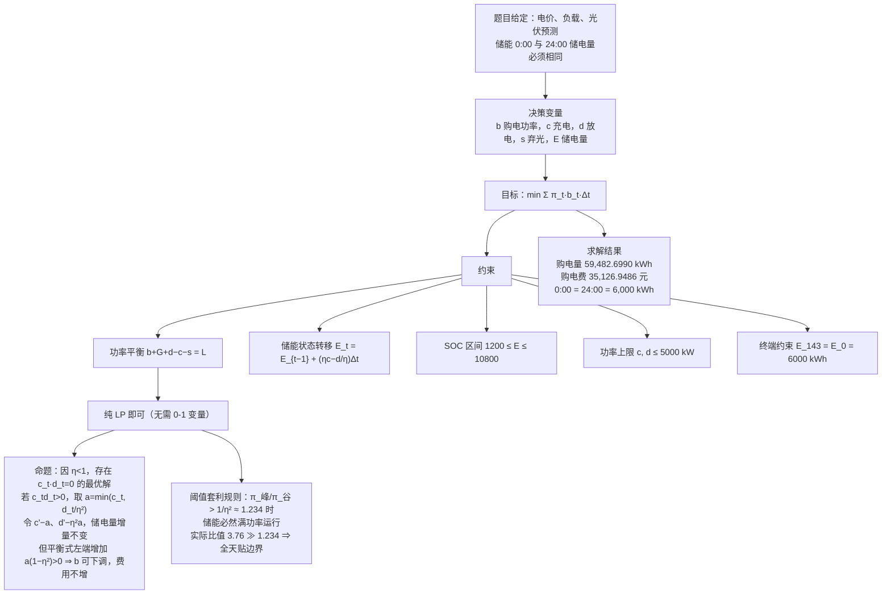
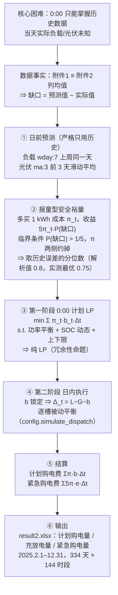
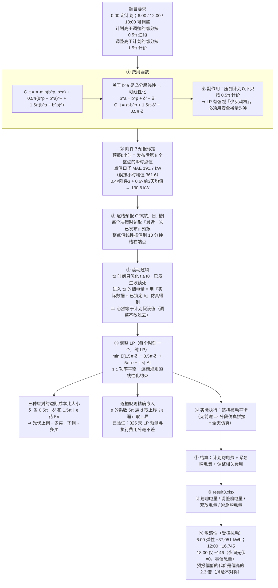

# 模型与口径说明

> 本文档把三问的建模思路、必须坚持的口径、以及所有对照实验的结论集中在一起，
> 论文写作时可直接按小节取用。

---

## 0. 三条核心口径（先看这个）

### 0.1 时间口径

第 $t$ 个时段（$t=0,\ldots,143$）覆盖 $[10t,\;10t+10]$ 分钟，即 $t=0$ 是 0:00–0:10、$t=143$ 是 23:50–24:00。
附件1 的时间戳按**区间右端点**解释（第 1 行 00:10 → $[00{:}00,00{:}10]$，末行 `0:00+1` → 23:50–24:00）。
这样 144 段恰好铺满 $[00{:}00,24{:}00]$。

> 官方模板 `result*.xlsx` 的表头（从 `0:10-0:20` 开始）比数据错位一格，是模板的笔误。
> 处理方式：**只按行序填数**，并在论文中声明本报告采用的口径。

### 0.2 附件3 的预报是「整点瞬时值」

题目说"可获得未来 24 小时**整点**的光伏发电功率预报"。经数据标定确认：
`预报k小时` = 发布后第 $k$ 个**整点时刻的瞬时功率（点值）**，而**不是**该小时的平均功率。

| `预报k小时` 的解释 | 与附件2 实际光伏的逐槽 MAE |
|---|---|
| 整点瞬时值（点值）→ 整点值线性插值到 10 分钟时段 | **191.7 kW** |
| 小时平均功率（区间 $[H-1,H]$ 的均值） | 361.6 kW |

**诊断依据**：按小时均值对齐时，逐小时平均偏差呈"上午正、下午负"的**导数形状**
（8:00 为 $+733$ kW、16:00 为 $-802$ kW），且该偏差约为 $0.5\,\mathrm{d}PV/\mathrm{d}t$ —— 典型的
"点值 vs 区间均值"错位半格的特征。改按点值口径后，逐步槽偏差塌缩到 $\pm100$ kW 以内。
另有滞后检验确认不存在额外的时间平移（$\pm10$ 分钟即显著变差）。

**预报精度对比（逐槽 MAE）**

| 预报源 | MAE (kW) |
|---|---|
| 附件1 基准日曲线（气候态平均） | 460.7 |
| 同星期外推 `wday:7` | 206.1 |
| 持续性 `ma:1` | 182.3 |
| 前 3 天滑动平均 `ma:3` | 152.7 |
| 附件3 @ 0:00 发布（点值口径） | 191.7 |
| **$0.4\times$附件3 $+\,0.6\times$`ma:3`** | **130.6** |

⇒ 单用附件3 反而不如历史外推，但**两者混合后最优**（比单用历史好 14.5%）。问题三采用混合权重 0.4。

### 0.3 储能执行：逐槽被动平衡

购电量 $b$ 一经锁定，每个时段的**储能净动作就被唯一决定**：

$$d_t-c_t-s_t-e_t=\Delta_t,\qquad \Delta_t=L_t-G_t-b_t$$

$$\begin{cases}
\Delta_t>0:\; d_t=\min\bigl(\Delta_t,\;\bar P,\;(E_{t-1}-E_{\min})\eta/\Delta t\bigr),\quad e_t=\Delta_t-d_t \;(紧急购电)\\[2pt]
\Delta_t<0:\; c_t=\min\bigl(-\Delta_t,\;\bar P,\;(E_{\max}-E_{t-1})/(\eta\Delta t)\bigr),\quad s_t=-\Delta_t-c_t \;(弃光)
\end{cases}$$

**性质**：

1. $e_t>0 \iff E_t=E_{\min}$（只要掏紧急购电，电池必然已经见底）；$s_t>0 \iff E_t=E_{\max}$。
2. **无前瞻** ⇒ 每个时段只依赖"当前 SOC + 当前时段数据" ⇒ **全天仿真 ≡ 分段仿真拼接**。
3. 等价于「**严格执行日前储能计划 + 用储能全额吸收预测偏差**」。
4. 它是**给定购电量的最优逐时段响应**（每槽都最大化抑制 $5\pi$ 紧急购电），
   但不做跨时段的储能调度 —— 这一点是后面所有对照实验的关键。
5. 在分时段电价下，**储备电量应对峰段缺口**这件事它不做，因此有约 7% 的代价（见 §3.4）。

实现：`config.simulate_dispatch(L, G, b, E0, t_from=0, t_to=None)`。

---

## 1. 数据标定事实

| 事实 | 证据 |
|---|---|
| 附件1 = 基准日/典型日 | 附件1 负载 $\equiv$ 附件2 列均值（最大绝对差 $5\times10^{-5}$）；光伏（最大绝对差 0.043）；电价 $\equiv$ 附件4 列均值（$5.2\times10^{-5}$） |
| 附件1 的光伏列名是"光伏发电**预测**功率"，附件2 是"光伏发电**实际**功率" | 正好构成"预测 vs 实际" |
| 附件2 | 365 天 $\times$ 144 槽，无缺失；负载 1995.7–7978.9 kW；光伏 0–10216.2 kW |
| 附件3 | 1460 行 = 365 天 $\times$ 4 个发布时刻（0:00/6:00/12:00/18:00），列 `预报1小时`…`预报24小时` |
| 附件4 | 365 $\times$ 145，逐日电价；全局 0.0076–1.7936，均值 0.7662 |
| 附件1 电价 | 0.3713–1.3952，日均 0.7662 |

**分档（按电价 33%/67% 分位）**：谷 $\le0.4424$（48 段 / 8.0 h）、峰 $\ge0.9371$（49 段 / 8.2 h）。
紧急购电单价 $5\pi$：**谷 2.143、平 3.711、峰 5.600 元/kWh**（峰谷比 2.61）。

---

## 2. 问题一：单日 MILP 计划

### 2.1 思维导图



### 2.2 结果

| 项 | 值 |
|---|---|
| 全天计划购电量 | 59,482.6990 kWh |
| 全天购电费 | 35,126.9486 元 |
| 0:00 / 24:00 储电量 | 6,000 / 6,000 kWh |

`q1.py` 与 `storage.py` 两份独立实现结果**完全一致**（互为验证）；`storage.py` 额外输出 10 分钟粒度 SOC。

### 2.3 敏感性分析（`q1_sensitivity.py` → `q1_敏感性分析.txt`）

图：`figures/q1/fig_敏感性分析.png`（2×3：电价拉伸 / 效率 / 功率上限 / SOC 上下限 / 输入偏差）

**（1）电价结构：幂律拉伸 $\pi_t(\rho)=\pi_{\min}\cdot(\pi_t/\pi_{\min})^{\rho}$**

峰谷价比变为 $(\pi_{\max}/\pi_{\min})^{\rho}=3.758^{\rho}$。理论阈值：套利有利当且仅当
$\pi_{\text{峰}}/\pi_{\text{谷}}>1/\eta^2=1.2346$，即 $\rho^*=\ln(1.2346)/\ln(3.758)=\mathbf{0.159}$。

| $\rho$ | 峰谷比 | 均价 | 购电费 | 储能吞吐量 | 峰段购电占比 | 无储能费用 | 储能价值 |
|---|---|---|---|---|---|---|---|
| 0.000 | 1.000 | 0.3713 | 21,063.5 | 11,309 | 36.4% | 22,942.6 | 1,879 |
| 0.150 | 1.220 | 0.4093 | 23,016.3 | 11,309 | 27.7% | 25,291.1 | 2,275 |
| **0.165** | **1.244** | 0.4134 | 23,226.8 | **11,309** | 27.7% | 25,545.6 | 2,319 |
| **0.170** | **1.252** | 0.4148 | 23,297.1 | **12,817** | 26.4% | 25,631.3 | 2,334 |
| 0.185 | 1.277 | 0.4190 | 23,499.9 | 19,276 | 21.1% | 25,890.8 | 2,391 |
| 0.200 | 1.303 | 0.4232 | 23,682.0 | 22,378 | 18.6% | 26,154.3 | 2,472 |
| 0.300 | 1.488 | 0.4531 | 24,880.1 | 29,704 | 17.1% | 28,015.2 | 3,135 |
| 0.500 | 1.938 | 0.5220 | 27,253.1 | 36,757 | 16.8% | 32,350.0 | 5,097 |
| 1.000 | 3.758 | 0.7662 | **35,126.9** | 37,541 | 16.7% | 48,052.0 | 12,925 |
| 1.500 | 7.284 | 1.1693 | 47,445.6 | 38,817 | 16.7% | 74,798.5 | 27,353 |

**结论**：

1. 第一个吞吐量台阶出现在峰谷比 **1.244 → 1.252**，与理论值 $1/\eta^2=1.2346$
   **相差不到 1.4%** —— 模型正确捕捉了「套利阈值」这一物理本质；
2. 跳变是**台阶式**（共 7 处，如 1.269→1.278 处再跳 50%），不是单一拐点，
   因为储能日吞吐受 SOC 区间限制，能配对的峰谷时刻随价差扩大被逐个激活；
3. $\rho<\rho^*$ 时吞吐量并非为零（约 1.1 万 kWh 的平台）：储能仍在
   **把午间富余光伏搬到晚间以避免弃光** —— 这是 $\eta<1$ 就成立的无风险收益，
   与价差无关。**储能的两种价值（避免弃光 / 赚取价差）在这里被干净地分开了**；
4. 峰段购电占比从 36.4%（无价差）单调降到 16.7%（现状），说明套利越有利，
   购电越向谷段集中。

**（2）储能参数敏感性**（单参数扫描，其余取题目值；基准购电费 35,126.9 元）

| 参数 | 基准值 | 取值范围 | 购电费变化 | 最有利取值 |
|---|---|---|---|---|
| 充电效率 $\eta$ | 0.90 | 0.78 ~ 0.96 | $+3{,}771.8$ ~ $-1{,}621.7$ | 0.96 |
| 额定功率 $\bar P$ | 5000 kW | 2000 ~ 8000 | $+2{,}458.8$ ~ $-115.0$ | 8000 |
| SOC 上限 $E_{\max}$ | 10800 kWh | 6000 ~ 12000 | $+4{,}931.8$ ~ $-784.7$ | 12000 |
| SOC 下限 $E_{\min}$ | 1200 kWh | 0 ~ 2400 | $-790.4$ ~ $+909.5$ | 0 |

**结论**：效率 $\eta$ 是第一杠杆（吞吐量按 $\eta$ 折损），SOC 可用区间次之
（上下限各约 ±790 元/日），**功率上限影响最小**（5000 → 8000 kW 只省 115 元/日）：
因为储能的最优调度本来就贴近 SOC 边界，很少撞到功率上限。
> 这给工程建议提供了依据：**提升储能价值应优先提高 SOC 可用区间与效率，
> 而不是继续加大功率。**

**（3）输入偏差下的鲁棒性**（用附件1 求计划，再在偏差下执行）

| 情景 | 购电量偏差 (kWh) | 缺口 (kWh) | 多弃光 (kWh) | 追加费用 | 完全信息重解 |
|---|---|---|---|---|---|
| 负载 ×0.90 | $-11{,}102.5$ | 0 | 11,102.5 | **0.0** | $-7{,}053.3$ |
| 负载 ×0.95 | $-5{,}551.2$ | 0 | 5,551.2 | **0.0** | $-3{,}574.8$ |
| 负载 ×1.05 | $+5{,}551.2$ | 5,551.2 | 0 | **22,079.8** | $+3{,}707.2$ |
| 负载 ×1.10 | $+11{,}102.5$ | 11,102.5 | 0 | **44,159.7** | $+7{,}618.9$ |
| 光伏 ×0.80 | $+11{,}096.6$ | 11,096.6 | 0 | **44,305.1** | $+7{,}142.1$ |
| 光伏 ×0.90 | $+5{,}548.3$ | 5,548.3 | 0 | **22,152.5** | $+3{,}295.6$ |
| 光伏 ×1.10 | $-5{,}548.3$ | 0 | 5,548.3 | **0.0** | $-2{,}915.0$ |
| 光伏 ×1.20 | $-11{,}096.6$ | 0 | 11,096.6 | **0.0** | $-4{,}253.0$ |

**这是全文最重要的一处「不对称」**：

- 负载**上调**或光伏**下调** ⟹ 缺电 ⟹ 只能按 $5\pi$ 紧急购电，追加费用立刻升到几千元；
- 负载**下调**或光伏**上调** ⟹ 富余 ⟹ 只是多弃光（**免费**），不罚款。

⟹ 偏差的费用函数**单边陡峭**，这正是问题二必须留**正**裕量的根源。

**（4）裕量在坏情景下的作用**（先按 $L+h$ 求计划，再用实际值执行）

| 情景 | $h=0$ | $h=200$ | $h=400$ | $h=600$ | $h=800$ | $h=1000$ |
|---|---|---|---|---|---|---|
| 负载 ×1.10 | 79,287 | 64,041 | 49,798 | **44,901** | 48,314 | 51,790 |
| 光伏 ×0.90 | 57,279 | 51,323 | 47,805 | **46,481** | 48,314 | 51,790 |

**结论**：两个坏情景的最优裕量都落在 600 kW 附近，**费用曲线是 U 形的**
（裕量过大会买入用不掉的电）。这从另一个角度印证了报童模型：
最优裕量应与「预期偏差的幅度」同量级，而不是越大越好。

---

## 3. 问题二：全年 0:00 计划 + 日内执行

### 3.1 思维导图



### 3.1.1 负载周期性的证据（支撑「lag = 7」的预测依据）

图：`figures/q2/` 下四张单图 + 一张组合图（脚本 `q2_periodicity.py`，文字报告 `q2_负载周周期性.txt`）

| 图文件 | 内容 | 证明什么 |
|---|---|---|
| `figA_周内各天平均曲线.png` | 一周内七天的平均负载曲线 | 5 天高负载 vs 2 天低负载，相差 **37%** |
| `figB_同星期曲线叠加.png` | 全年 52 个同星期曲线叠加 | 离散带仅 **±371 kW**，同星期高度可重复 |
| `figC_自相关系数.png` | 逐槽自相关 vs 滞后天数 | 滞后 2~5 天为负，**7/14/21 天处尖峰** → 周期 = 7 天 |
| `figD_预测方法精度对比.png` | 各预测方法的逐槽 MAE | lag7 = **175.8 kW**，全场最低 |
| `fig_负载周周期性.png` | 上述四张的 2×2 组合图 | 一眼看全 |

**周内模式**：全年 365 天按星期分组，低负载日只有 **周五、周六**（日均 3265 kW），
其余五天（周一~周四、周日）日均 5168 kW，**相差 37%**。

> ⚠️ 注意：这份数据的「休息日」是**周五、周六**，不是周末。
> 论文里不要写成「周末用电少」。

**自相关**（逐槽 Pearson 相关，按天平均）：

| 滞后（天） | 1 | 2 | 3 | 4 | 5 | 6 | **7** | 8 | … | **14** |
|---|---|---|---|---|---|---|---|---|---|---|
| 相关系数 $r$ | 0.4344 | −0.1026 | −0.1088 | −0.1152 | −0.1151 | 0.4196 | **0.9528** | 0.4141 | … | **0.9329** |

滞后 2~5 天甚至为**负**相关，而在 7 天倍数处出现尖峰 ⟹ **周期恰为 7 天**。

**离散度**：滞后 1 天的平均绝对偏差 650.6 kW，滞后 7 天只有 **175.8 kW**（接近 4 倍）；
同星期内部的逐槽标准差均值仅 371~378 kW。

**预测精度**（评估区间：第 21 天之后，逐槽 MAE）：

| 方法 | MAE (kW) | 相对持续性 |
|---|---|---|
| 持续性 lag1 | 650.6 | — |
| **上周同一天 lag7** | **175.8** | **−73.0%** |
| lag14 | 208.6 | −67.9% |
| 前3天均值 ma3 | 943.1 | +45.0% |
| 前7天均值 ma7 | 781.5 | +20.1% |
| 附件1 基准日 | 791.5 | +21.7% |

⇒ **lag = 7 比持续性预测（lag1）低 73.0%、比附件1 基准日低 77.8%**，
这就是第二问采用「上周同一天」预测小区负载的依据。

> 对照：光伏的周期性与负载不同 —— 光伏用前 3 天滑动平均 `ma:3` 反而更好
> （见 §0.2 的精度表），所以第二问的预测规格是 `wday:7`（负载）`|` `ma:3`（光伏）。

### 3.2 结果

| 项 | `hedge=0`（无裕量） | 固定 300 kW 均匀 | 分位数 q=0.75, win=60 | **分位数 q=0.76, win=30（主方案）** |
|---|---|---|---|---|
| 裕量取值 | 0 | 全天恒定 300 kW | 逐时段取历史 60 天误差的 0.75 分位（日均 215 kW） | 逐时段取历史 30 天误差的 0.76 分位（日均 227 kW） |
| 计划购电量 | 20,070,215.3 kWh | 21,795,174.4 kWh | 21,363,232.1 kWh | 21,442,248.8 kWh |
| 计划购电费 | 12,195,725.6 元 | 13,488,522.9 元 | 13,101,901.1 元 | 13,155,069.0 元 |
| 紧急购电量 | 523,825.4 kWh（2.61%） | 112,059.1 kWh（0.51%） | 158,222.9 kWh（0.74%） | 141,988.6 kWh（0.66%） |
| 紧急购电费 | 3,032,588.7 元（19.9%） | 633,131.1 元（4.5%） | 881,137.4 元（6.3%） | 794,039.5 元（5.7%） |
| **总购电费** | **15,228,314.3 元** | **14,121,654.0 元** | **13,983,038.5 元** | **13,949,108.5 元** |
| 出现紧急购电的天数 | 309 / 334 天 | 85 / 334 天 | 142 / 334 天 | 141 / 334 天 |
| 期末（12/31 24:00）储电量 | 1,237.9 kWh | — | 1,587.9 kWh | 1,653.1 kWh |

> **安全裕量是当前口径下最大的单一杠杆**：引入裕量使计划购电费上升，
> 但紧急购电费大幅下降，**相对无裕量净省 127.9 万元（8.4%）**。
> 机理：逐槽规则下储能被动吸收全部偏差、不会主动留余量，一旦电池提前见底，
> 后续缺口全部按 $5\pi$ 结算；必须靠「多买一点」把缺口概率压下去。
>
> 主方案（分位数裕量）比固定 300 kW 均匀裕量 **再省 17.3 万元（1.2%）**：
> 它的最大优点是**按误差形状加码** —— 回归 19:00 这种预报很准的时段几乎不加，
> 而 12:00 这种预报最不准的时段多买。固定 300 kW 则是在误差本就很小的时段纯浪费。
>
> 注意一个反直觉的细节：主方案的平均裕量（227 kW）比固定 300 kW **小**、
> 紧急购电量也更多（14.2 万 vs 11.2 万 kWh），总费用却更低 —— 省的是「买错时段」的钱。

### 3.3 储能执行口径对比

| 口径 | 计划购电费 | 紧急购电费 | 合计 | 备注 |
|---|---|---|---|---|
| 储能严格按计划执行（`hedge=300`） | 1,375.1 万 | 139.5 万 | 1,514.6 万 | 偏差全靠紧急购电填 |
| 逐槽被动平衡 · 无裕量 | 1,219.6 万 | 303.3 万 | 1,522.8 万 | 因果、无前瞻、可执行 |
| 逐槽被动平衡 · 固定 300 kW | 1,348.9 万 | 63.3 万 | 1,412.2 万 | |
| **逐槽被动平衡 · 报童分位裕量** | **1,315.5 万** | **79.4 万** | **1,394.9 万** | **主方案（q=0.76, win=30）** |
| 完全信息最优再调度（`hedge=0` 计划） | 1,223.5 万 | 190.6 万 | 1,414.1 万 | **事后下界，不可执行** |

> 注：上表第 1、4 行取自 `q2_实时再调度对比.txt`，该文件由**较早版本的代码**生成，
> 绝对数值与当前代码有约 0.3% 的差异；要核对请执行 `python q2_rt.py` 重新生成。

### 3.4 主口径与完全信息下界的差距来自哪里（`q2_口径诊断.txt`）

> 下表对**同一个 `hedge=0` 计划**比较两种储能调度方式，因此差距可以干净地归因给「储能时序」，
> 不掺杂计划质量的差异。

| | 逐槽被动平衡 | 完全信息最优 | 差 |
|---|---|---|---|
| 计划购电费 | 12,195,725.6 | 12,234,616.2 | $+38{,}890.6$ |
| 紧急购电量 | 523,825.4 kWh | **566,893.9 kWh** | **$+43{,}068.5$** |
| 紧急购电费 | 3,032,588.7 | **1,906,390.1** | **$-1{,}126{,}198.6$** |
| **总购电费** | **15,228,314.3** | **14,141,006.3** | **$-1{,}087{,}308.0$** |
| 紧急购电量落在峰段 | **84.2%** | 16.1% | |
| 紧急购电费落在峰段 | **91.8%** | 28.0% | |

**关键结论：完全信息最优反而多买了 4.3 万 kWh 紧急电（+8.2%），却省了 112.6 万元。**

差距**全部来自紧急购电的时段选择**，与储能吞吐能力无关：

```
 小时   逐槽法      完全信息最优   5π单价
 0:00      346       16,590      2.13     ← 优解在谷段主动掏紧急购电
 3:00    1,260       15,068      2.18
 5:00    1,329       23,955      2.63
 8:00   32,985          678      5.41
 9:00   50,677        3,296      4.89
11:00      341       83,830      2.36     ← 中午光伏大发、电价低，掏这里最划算
12:00        0       59,275      2.62
18:00    4,931       27,892      6.37
19:00   63,216        9,093      6.74
20:00  256,267       18,843      6.33     ← 逐槽法一小时掏了全年 49% 的紧急电
21:00   24,785       22,669      4.14
```

逐槽法在早上 8:00–10:00（晨间爬坡缺口）就把电池耗光，硬扛到晚间峰段，
于是 20:00 一个小时掏了 256,267 kWh × 6.33 元 = **162.2 万元**，占它全年紧急购电费的 53%。

**这就是"无前瞻"的代价：7.1%。** 论文中把它写成 **完全信息下界（clairvoyant lower bound）**，
用来衡量主口径的改进空间 —— 而问题三的调整机制正好把其中 91% 合法地捞了回来（见 §4.5）。

### 3.5 安全裕量的定参依据与敏感性分析（`q2_sensitivity.py` → `q2_敏感性分析.txt`）

图：`figures/q2/fig_敏感性分析.png`（2×2：预测精度 / 紧急电价倍率 / 裕量随误差缩放 / 分位数曲线）

**（1）报童模型给出解析解，不需要任何调参**

紧急电价 = $k\pi$（题中 $k=5$），多买 1 kWh 值得当且仅当缺口概率 $>1/k$，
而 $\pi$ 在两侧约掉 ⟹ **最优裕量 = 历史误差的 $(1-1/k)$ 分位数 = 0.8 分位数**，
与误差幅度无关。全年费用曲线：

| 裕量分位数 $q$ | 日均裕量 (kW) | 计划购电费 | 紧急购电费 | **总购电费** |
|---|---|---|---|---|
| 0.60 | 73 | 12,514,976.4 | 1,971,892.5 | 14,486,868.9 |
| 0.70 | 164 | 12,891,345.1 | 1,157,436.8 | 14,048,781.9 |
| 0.75 | 215 | 13,101,901.1 | 881,137.4 | 13,983,038.5 |
| **0.80（报童解析值）** | **273** | **13,347,034.6** | **654,941.1** | **14,001,975.7** |
| 0.85 | 343 | 13,646,443.4 | 480,755.7 | 14,127,199.1 |
| 0.90 | 439 | 14,069,299.2 | 321,244.4 | 14,390,543.6 |
| 0.95 | 591 | 14,789,468.5 | 142,741.5 | 14,932,210.0 |
| （对照）固定 300 kW | 300 | 13,488,522.9 | 633,131.1 | 14,121,654.0 |

> 表中均为 $\text{win}=60$ 下的粗网格（步长 0.05）。解析值 $q^*=0.8$ 与粗网格最低点
> $q=0.75$ **仅差 1.89 万元（0.14%）**，说明费用曲线在 $q\in[0.75,0.80]$ 上非常平坦 ——
> 采用哪一档都不影响结论，因此**采用分位数规则是稳健的，而非对评价年份的过拟合**。
> （更细的 0.01 步长网格与窗口长度联合寻优见本节（6））
> 两者都优于手调的固定 300 kW（分别省 13.9 万 / 12.0 万元）。

**（2）预测精度敏感性**：把预报误差整体缩放 $\lambda$ 倍（$F'=Y+\lambda(F-Y)$）

| $\lambda$ | 逐槽 MAE (kW) | 计划购电费 | 紧急购电量 (kWh) | 紧急购电费 | **总购电费** | 紧急天数 |
|---|---|---|---|---|---|---|
| 0.0（完美预测） | 0.0 | 13,514,290.5 | 0.0 | 0.0 | 13,514,290.5 | 0 / 334 |
| 0.5 | 138.3 | 13,495,677.5 | 12,171.3 | 75,075.6 | 13,570,753.1 | 25 / 334 |
| 1.0（实测口径） | 276.7 | 13,488,522.9 | 112,059.1 | 633,131.1 | 14,121,654.0 | 85 / 334 |
| 1.5 | 415.0 | 13,497,462.3 | 256,686.4 | 1,442,177.2 | 14,939,639.5 | 128 / 334 |
| 2.0（误差加倍） | 553.4 | 13,529,657.1 | 406,481.1 | 2,250,217.0 | 15,779,874.0 | 147 / 334 |

> 总费用随误差**单调上升**（$\lambda=2$ 比 $\lambda=1$ 多花 165.8 万元，+11.7%），
> **上升全部来自紧急购电费**（63.3 万 → 225.0 万），计划购电费几乎不变（波动 < 0.3%）。
> 这说明：日前计划的「价差套利」部分对预测误差不敏感，误差的全部代价都落在**平衡缺口**上。

**（3）最优裕量随误差缩放（报童模型的直接检验）**：区块 60~190 日（130 天）

| $\lambda$ | 裕量 0 | 裕量 300 | 裕量 600 | 最优 |
|---|---|---|---|---|
| 0.5 | 5,079,162 | 4,787,533 | 5,216,683 | 300 |
| 1.0 | 5,836,835 | 5,198,549 | 5,320,603 | 300 |
| 2.0 | 7,090,318 | 6,187,440 | 6,058,893 | 600 |

> 误差放大 2 倍时最优裕量也大致翻倍（300 → 600 kW），**与报童模型「保持分位数不变」
> 的预言一致**：最优裕量不是固定常数，而应随误差幅度线性缩放。

**（4）紧急电价倍率 $k$ 敏感性**（裕量按 $1-1/k$ 分位自适应调整）

| $k$ | 理论分位 | 日均裕量 (kW) | 计划购电费 | 紧急购电量 (kWh) | 紧急购电费 | **总购电费** |
|---|---|---|---|---|---|---|
| 3 | 0.667 | 132 | 12,759,582.5 | 243,215.2 | 833,080.7 | 13,592,663.2 |
| 4 | 0.750 | 215 | 13,101,901.1 | 158,222.9 | 704,909.9 | 13,806,811.0 |
| 5 | 0.800 | 273 | 13,347,034.6 | 119,752.3 | 654,941.1 | 14,001,975.7 |
| 6 | 0.833 | 318 | 13,539,066.0 | 98,767.3 | 644,078.8 | 14,183,144.8 |
| 8 | 0.875 | 387 | 13,834,835.4 | 73,972.8 | 643,543.7 | 14,478,379.1 |

> $k$ 越大 → 最优分位越高 → 计划购电费上升、紧急购电费下降，**总费用单调上升**。
> 「5 倍」这个惩罚强度本身就是一个主导参数：若 $k$ 从 5 倍降到 3 倍，全年费用降 39 万元（2.8%）。
> 敏感性分析的实用价值在这里体现：**即使题目给定的 5 倍有偏差，采用分位数规则仍能自动适配**
> （无需重新调参），因为 $k$ 只通过 $1-1/k$ 进入模型。

**（5）敏感性结论对论文的写法**

- 主方案对预测精度的依赖在实测精度附近近似线性：$\\lambda=1\\to2$ 时逐槽 MAE 增加 276.7 kW、
  全年费用增加 165.8 万元（**约 60 万元 / 100 kW MAE**）；误差很小时边际代价更低（$\\lambda=0\\to1$ 约 22 万元/100 kW），
  说明**精度投资在误差已经很大时回报更高**；
- 裕量**函数形式**有解析依据（报童），不是凭空设计；但它有两个标定参数（分位水平 $q$、
  回看窗口 win），下一小节分别做精细寻优与稳健性检验；
- 「5 倍紧急电价」是最强外部参数，但模型对它也是自动适配的。

**（6）裕量参数的精细寻优**（`q2_fine_tune.py` → `q2_裕量精细寻优.txt`；
图 `figures/q2/fig_裕量寻优.png`）

两个标定参数：分位水平 $q$ 与回看窗口 win。各自单维扫描（全年 334 天实测）：

| $q$ | 0.72 | 0.74 | **0.75** | **0.76** | 0.78 | 0.80 |
|---|---|---|---|---|---|---|
| 总费用（win=60） | — | 1,399.1 万 | 1,398.3 万 | **1,398.0 万** | — | 1,400.2 万 |
| 总费用（win=30） | 1,399.2 万 | 1,396.2 万 | 1,395.3 万 | **1,394.9 万** | 1,395.1 万 | 1,396.6 万 |

| win（天） | 20 | **30** | 45 | 60 | 90 | 120 |
|---|---|---|---|---|---|---|
| 总费用（q=0.76） | 1,401.2 万 | **1,394.9 万** | 1,395.6 万 | 1,398.0 万 | 1,401.0 万 | 1,403.5 万 |

**两个结论**：

1. **分位水平 $q$ 不敏感**：$q\in[0.75,0.78]$ 内费用差 <0.03%，与报童解析值 0.80 也仅差 0.12%
   ⟹ 论文里直接用解析值 $1-1/k=0.8$ 即可，无需声称扫描值；
2. **回看窗口 win 是更大的杠杆**（但也不大）：30 天最优，比原先的 60 天省 3.1 万元（0.22%），
   而且 20 天更差、90~120 天明显更差 ⟹ 是**内部极小点**而非边界效应。
   机理：窗口长度是「分位数估计的偏差–方差权衡」—— 误差水平本身在变
   （实测 12:00 那槽的 $q_{0.75}$ 在一年内从 259 变到 678 再回落到 439 kW），
   窗口太长跟不上、太短噪声大。

**（7）样本外稳健性检验：把一年劈成两半**（`q2_tune_robust.py` → `q2_裕量稳健性检验.txt`）

把评价区间从中间劈开，两半各自独立比较 win（固定 $q=0.76$）：

| win（天） | 20 | **30** | 45 | 60 | 90 |
|---|---|---|---|---|---|
| 上半年（167 天，万元） | 680.1 | **674.0** | 676.2 | 678.0 | 681.2 |
| 相对该半最优 | +0.90% | **0** | +0.33% | +0.58% | +1.07% |
| 下半年（167 天，万元） | 720.8 | 720.6 | **719.1** | 719.8 | 719.5 |
| 相对该半最优 | +0.24% | +0.21% | **0** | +0.09% | +0.06% |

**诚实的结论**：

- 两半的最优窗口分别是 **30 天 / 45 天**，都落在 30~60 区间；
- 但「30 天优于 60 天」**只在半年里成立**：上半年 30 天省 3.9 万元（0.58%），
  下半年 30 天反而贵 0.8 万元（0.12%）——**该效应是季节性的，不是普遍规律**；
- 全年最优仍是 30 天，但它只是两半的加权平均（上半年幅度大 5 倍而压倒下半年）；
- ⟹ **论文里应写成「回看窗口在 30~60 天区间内不敏感（差 <0.25%）」，
  而不是「30 天是精确最优」**。前者稳健可信，后者有过拟合风险。

> **顺带说明为何不用「分上下半年各取不同窗口」**：那样只再省 1.76 万元（0.13%），
> 却要多定 3 个参数（切分点 + 两个窗口长度），而切分点本身是「看着数据切的」。
> 为 0.13% 的收益花 3 个自由度，性价比为负。

---

## 4. 问题三：多阶段滚动调整

### 4.1 题目给的费用口径（原文）

> 计划购电量高于调整购电量的部分，违约电价是交易时刻电价的 50%。
> 调整购电量高于计划购电量的部分，超出部分的电价是交易时刻电价的 1.5 倍。

$$C_t=\underbrace{\pi_t\min(b^p_t,b^a_t)}_{\text{计划内部分}}
+0.5\,\pi_t\bigl(b^p_t-b^a_t\bigr)^{+}
+1.5\,\pi_t\bigl(b^a_t-b^p_t\bigr)^{+}$$

**线性化**（$b^a_t=b^p_t+\delta^+_t-\delta^-_t$，$\delta^\pm\ge0$）：

$$C_t=\pi_t b^p_t+1.5\pi_t\delta^+_t-0.5\pi_t\delta^-_t$$

该函数关于 $b^a_t$ 是**凸的分段线性函数**（斜率由 $-0.5\pi$ 跳到 $+1.5\pi$），可直接用 LP 表达。

> ⚠ **注意这个费用结构引出的"少买动机"**：把 $b^a$ 压到 $b^p$ 以下，被取消的那部分只按 $0.5\pi$ 计价，
> 而按计划买要付 $\pi$。所以 LP 有强烈动机少买 → 必须用安全裕量对冲（§4.6）。

### 4.2 逐槽规则在 LP 中的精确嵌入

调整阶段要在 LP 里**预测**储能的执行结果，所以必须把 §0.3 的规则写进约束：

$$d_t-c_t-s_t-e_t=L_t-G_t-b_t$$
$$d_t\le\bar P,\qquad d_t\le(E_{t-1}-E_{\min})\eta/\Delta t$$
$$c_t\le\bar P,\qquad c_t\le(E_{\max}-E_{t-1})/(\eta\Delta t)$$
$$s_t\le G_t,\qquad E_t=E_{t-1}+(\eta c_t-d_t/\eta)\Delta t,\qquad E\in[E_{\min},E_{\max}]$$

目标里 $e_t$ 的系数 $5\pi_t$ 远大于 0、$s_t$ 的系数 $\varepsilon=10^{-6}$ 极小，
于是最优解中 $d_t$、$c_t$ 会自动取到各自上界，**恰为逐槽规则**。
（$c_t d_t=0$ 由 $\eta<1$ 自动成立，无需 0-1 变量。）

**这意味着一次纯 LP 就能精确预测执行结果，不需要 "LP + 仿真" 嵌套迭代。**

### 4.3 一致性验证（`_check3` 类实验的结论）

在 325 天上对比「LP 内部假设的结果」vs「同一条 $b$ + 逐槽规则 + 同一预报」：

| | 紧急购电量 | $t\ge36$ 段费用 |
|---|---|---|
| LP 内部假设 | 0.0 kWh | 7,966,197.9 元 |
| 同 $b$ + 逐槽 + 同一预报 | 0.0 kWh | 7,966,197.9 元 |
| 同 $b$ + 逐槽 + **实际数据** | 389,939.7 kWh | 10,215,428.4 元 |

**分毫不差，325 天里 LP 主动掏紧急购电的天数 = 0。**
⇒ 嵌入是精确的，LP 挑出的 $b$ 与实际执行完全自洽。

### 4.4 为什么问题三必须用逐槽法

**严格说不是题目要求** —— 题目第三问的决策变量只有购电量 $\{b^p_t\},\{b^a_t\}$，储能怎么动由模型定义。

**真正"必须"的是这条自洽性要求：**

> 调整 LP 里假设的「未来储能行为」，必须与实际执行时的储能行为一致，
> 否则 LP 挑出的 $b$ 是**为错误模型优化的**。

逐槽法满足它，靠三个性质：

1. **可被 LP 精确刻画**（§4.3 已验证）→ 无嵌套迭代，一次 LP 解决。
   若改用"完全信息最优"或"滚动 MPC"当执行规则，调整问题就变成双层嵌套优化，只能反复仿真逼近。
2. **无前瞻的确定性规则** → 全天仿真 $\equiv$ 分段仿真拼接。
   多阶段滚动必须做到"6:00 只改 $t\ge36$、12:00 只改 $t\ge72$……"，
   用未来信息改过去是禁止的，而这条性质保证了过去的决策不会被未来的决策污染。
3. **让 Q2 → Q3 的收益可干净归因**：执行层完全固定，两问唯一的差别就是"$b$ 能不能被调整"。

**代价**：放弃"利用已知电价主动挑选紧急购电时段"的能力。在 `hedge=0` 计划下这个代价是 7.1%（§3.4）。
这个代价在论文里是**优点而非缺点** —— 它给出了一个上界对照，说明"改进空间在哪里"；
而两块**同样只依赖因果信息**的机制把它基本填平了：

| 机制 | 额外节省 | 是否需要预知未来 |
|---|---|---|
| 报童型安全裕量（问题二就能用） | 110.7 万元 | 否，仅用历史误差分布 |
| 题目要求的多阶段预报更新（问题三） | 27.5 万元 | 否，仅用已发布预报 + 已发生实际值 |

两者**部分互补**，所以叠加收益小于各自的单独数额。

> 另注：**加密决策时刻反而更差**（§4.6 表）。因为每次调整都要付 $0.5\pi/1.5\pi$ 的偏离费，
> 而没有新预报信息时，多调整只会让 $b$ "过度拟合"错误的预测。

### 4.5 思维导图



### 4.6 结果与参数寻优

**全年结果（2025.2.1–12.31，334 天；`mix=0.4, hedge=300, adapt=0.2`）**

| 项 | 值 |
|---|---|
| 计划购电量 | 21,870,649.6 kWh |
| 调整后购电量 | 21,920,930.9 kWh（净 $+50{,}281.3$） |
| 计划购电费 | 13,529,286.4 元 |
| 调整相关购电费（含计划部分） | 13,675,006.3 元（$+145{,}719.9$） |
| 紧急购电量 | 34,077.2 kWh（占调整后购电量 0.16%） |
| 紧急购电费 | 172,468.8 元 |
| **总购电费** | **13,847,475.1 元** |
| 充电 / 放电 / 弃光 | 6,151,470.9 / 4,983,363.0 / 2,847,710.7 kWh |
| 出现紧急购电 / 发生调整的天数 | 75/334、334/334 天 |

**相对问题二（同为 `hedge=300`）节省 27.5 万元（1.9%）**，紧急购电费从 63.3 万降到 17.2 万元。
若把问题二退回无裕量的 1,522.8 万，则问题三共省 138.1 万元（9.1%）——
**两块机制都只依赖因果信息，因此这个 138.1 万元是合法可执行的收益。**

**参数寻优（区块 120~190，70 天）**

| 参数 | 扫描结论 |
|---|---|
| 光伏混合权重 `mix` | **0.4 最优**（纯附件3 最差：3.28 M） |
| 安全裕量 `hedge` | **300 kW 最优**。0→3.08 M，100→2.90 M，200→2.81 M，**300→2.793 M**，400→2.81 M，600→2.92 M |
| 负载当日自适应 `adapt` | **0.2 最优**（用当日已发生时段的实际/预报之比缩放剩余时段预报） |
| 决策时刻 | **(0, 6, 12, 18) 最优**；(0,3,…,21)→3.078 M；每小时→3.080 M（**加密更差**） |

基准配置 3,182,112 元 → 最优组合 **2,792,909 元**（省 38.9 万、12.2%）。

**全年验证**：`mix=0.4, hedge=300, adapt=0.2` 跑全年 334 天得 **1,384.7 万元**
（对应 `hedge=0` 的 1,423.6 万元，区块结论在全尺度上成立）。

**"是否需要引入其他时刻的预报"的结论**：

1. 0:00 的预报只决定计划骨架；
2. 6:00 与 12:00 的预报分别覆盖上午、下午的光伏爬坡段，边际价值最大；
3. **18:00 的预报只覆盖 19:00–24:00（夜间光伏恒为 0），几乎不含增量信息**；
4. 在已有预报之间加密决策时刻（用最近一次已发布预报 + 当日已发生的实际值）**反而更差**，
   因为每次调整都要承担 $0.5\pi/1.5\pi$ 的偏离费用，而没有新预报信息时调整只是"过度拟合"错误的预测。

⇒ 题目给定的四个时刻已经足够，**不需要引入其他时刻的预报**。

### 4.7 附件3 的预报如何传导到购电量（机制 + 受控扰动）

**机制：LP 在每个时段比三种应对的边际成本**

| 动作 | 边际成本 | 含义 |
|---|---|---|
| $\delta^-$：把 $b$ 压到计划**以下** | $-0.5\pi_t$ | 少买 1 kWh **省 0.5π**（「违约」部分只按 50% 计价） |
| $\delta^+$：把 $b$ 抬到计划**以上** | $+1.5\pi_t$ | 多买 1 kWh **花 1.5π** |
| $e$：该时段缺电、搞紧急购电 | $+5\pi_t$ | **花 5π** |

三者通过功率平衡 $d_t-c_t-s_t-e_t=Lf_t-Gf_t-b_t$ 互相牽制：

| 附件3 的修订 | 预测净负荷 | LP 的最优应对 | $\Delta b$ |
|---|---|---|---|
| **光伏上调** | 变小 | 电池更容易覆盖缺口 → 直接 $\delta^-$ **少买** | **负** |
| **光伏下调** | 变大 | 提前 $\delta^+$ 多买（1.5π）优于到时搞 $e$（5π）→ **多买** | **正** |

> 注意：它不是在「拟合负荷曲线」，而是在**比三种应对方式的边际成本**，
> 所以预报小改（$e=0$ 仍可行）时它**根本不动**，只有当修订大到足以改变可行性时才调整。

**受控扰动实验**（`q3_sensitivity.py` → `q3_光伏预报敏感性.txt`、
`figures/q3/fig_光伏预报敏感性.png`）

固定同一天、同一 0:00 计划 $b^p$、同一进入储电量 $E_{t_0}$，只把调整 LP 用的光伏预报乘以 $(1+\delta)$：

| 决策时刻 | −40% | −20% | −10% | 0% | +10% | +20% | +40% | 弹性 (kWh) |
|---|---|---|---|---|---|---|---|---|
| **6:00** | +20,701 | +9,703 | +5,012 | +700 | −3,448 | −5,755 | −8,940 | **−37,051** |
| **12:00** | +8,155 | +3,450 | +1,186 | −918 | −2,520 | −3,646 | −5,240 | −16,745 |
| **18:00** | +231 | +202 | +187 | +172 | +158 | +143 | +114 | **−146** |

（$\Delta Q$ 相对 0:00 计划，单位 kWh；样本日平均计划购电量为 65,327 kWh）

**三条可写进论文的结论**

1. **方向确认**：光伏预报上调 → 少买；下调 → 多买，与边际成本逻辑一致。
2. **18:00 的预报零信息量**：弹性只有 −146 kWh（6:00 是 −37,051），
   因为 18:00 的预报只覆盖 19:00–24:00，那时光伏恒为 0 —— 与 §4.6 的消融实验完全吻合。
3. **风险不对称**：6:00 时预报偏低（−40%）使购电量增加 20,701 kWh，
   而预报偏高（+40%）只使购电量减少 8,940 kWh，**前者是后者的 2.3 倍**。
   这是「多买一点」的安全裕量策略（§4.6 中 `hedge=300` 最优）的理论依据。

**另一条重要事实**：$\delta=0$（信息完全不变，仅用调整目标函数重新求解）时
$\Delta Q$ 均值只有 $-15$ kWh ≈ 0，说明**调整的收益确实来自附件3 的新预报**，
而不是无意义的重复求解。

**一个方法论坑（模型检验部分的素材）**：用「剩余时段预报修订量的**代数和**」与「购电量变化」
做相关，全年只有 $-0.013$（几乎为零），看起来像「预报没用」；
分解后也只是 $+0.183$，符号都不稳定。原因是**逐时段的修订会互相抵消**
（上午下调、下午上调），标量汇总掩盖了逐点响应。
**判断响应方向必须用受控扰动**，不能看总量相关。

---

## 5. 问题四：波动电价

### 5.1 附件4 的电价特征（实测）

| 指标 | 附件1（固定） | 附件4（波动） |
|---|---|---|
| 算术平均电价 | 0.7662 | **0.7575（−1.13%）** |
| **净负荷加权平均电价** | 0.7814 | **0.8109（+3.78%）** |
| 日内峰谷比 | 3.76（固定） | 5.74（逐日均值） |
| 逐日均价范围 | 恒定 | 0.5378 ~ 0.9290（std 0.104） |

> **关键发现：附件4 的算术均价更低，但净负荷加权均价反而高 3.78%** ——
> 说明电价波动与负载曲线**反相关**：负载高的时段 / 日期电价偏高。
> 这也直接解释了问题四总费用上升 4.4~4.9%：不是模型问题，而是电价本身的系统性差异。

另外，附件4 每行的列均值 $≡$ 附件1 的电价（最大绝对差 $5.2\times10^{-5}$），
说明二者是「同一分时形状 + 逐日水平漂移 + 逐槽噪声」的关系。

### 5.2 模型

**假设**：当天 0:00 已获知当天完整电价曲线（日前市场提前公布），因此电价无需预测。
这与题目「根据附件4 的电价数据」一致。

**做法**：把标量 $\pi_t$ 换成矩阵 $\Pi_{d,t}$，其余模型结构、口径、参数**完全不变**，
直接重算问题二与问题三。

### 5.3 结果

| 口径 | 固定电价（附件1） | 波动电价（附件4） | 变化 |
|---|---|---|---|
| 对应问题二 | 13,949,108.5 | **14,634,080.5** | +684,972.0（+4.91%） |
| 对应问题三 | 13,847,475.1 | **14,463,547.9** | +616,072.8（+4.45%） |
| 参考：无储能、按现货价买净负荷 | 16,407,319.6 | 17,026,782.9 | +619,463.3（+3.78%） |

波动电价下问题三相对问题二仍省 **17.1 万元（1.2%）**，与固定电价下的结论一致。

### 5.4 跨日套利：逐日 LP vs 7 日联合 LP（`q4_跨日套利分析.txt`）

两者都用**实际**净负荷与**实际**电价（无预测误差），只差决策视界：

| 电价 | 逐日 LP | 7 日联合 LP | 节省 |
|---|---|---|---|
| 附件1（固定） | — | — | **0.139%**（见 `q2_多日LP对比.txt`） |
| 附件4（波动） | 1,629,250.9 元 | 1,622,550.5 元 | **0.411%** |

**结论（与直觉相反，但很重要）**：

1. 波动电价确实打开了跨日套利空间，联合 LP 的收益从 0.139% 升到 0.411%（约 3 倍）；
2. 但**绝对量仍然很小** —— 因为储能可用容量仅 9600 kWh，而日均净负荷约 7 万 kWh，
   「跨日搬运能量」受容量硬约束；
3. 实用结论：**波动电价下仍可采用逐日决策**（问题二 / 问题三的模型），
   多日联合优化只是理论上更完整的形式，实际增益有限。

> 注：`q4.py multiday` 首次跑出「联合 LP 更贵 4.8%」的异常值，原因是逐日 LP 用了
> **预测**净负荷（且费用不含紧急购电）而联合 LP 用了**实际**净负荷，两者不可比。
> 已修正为两者都用实际值。

产出：`result4-2.xlsx`（3 张表）、`result4-3.xlsx`（4 张表）。

---

## 6. 论文用模型命名

**总标题**：计及日前预测偏差的微网购电–储能协同调度优化模型

| 层次 | 命名 |
|---|---|
| 总体框架 | 「日前计划–实时结算」两阶段优化框架（2S-DPS） |
| 问题一 | 含终端储电量约束的单日 MILP（配"充放电冗余性命题"与"阈值套利规则"） |
| 问题二·预测 | 周周期–滑动平均组合日前预测模型（WDAY+MA） |
| 问题二·裕量 | 报童型安全裕量模型 |
| 问题二·整体 | 计及紧急购电惩罚的日前调度模型 |
| 问题三 | 带调整惩罚的多阶段滚动优化模型（四阶段滚动视界） |
| 问题四 | 随机电价下的鲁棒 / 随机优化模型 |

---

## 附：关键文件对照

| 结论 | 文件 |
|---|---|
| 问题一：电价结构 / 储能参数 / 输入偏差 敏感性 | `q1_敏感性分析.txt`、`figures/q1/fig_敏感性分析.png` |
| 完全信息下界对比、逐小时紧急购电分布 | `q2_口径诊断.txt` |
| 储能执行口径对比（按计划 / 实时再调度） | `q2_实时再调度对比.txt` |
| 与队友方案 2×2 对标 | `q2_对标队友.txt` |
| 逐日 LP vs 多日联合 LP | `q2_多日LP对比.txt` |
| 裕量的时段分布特征与分位数寻优 | `q2_裕量优化.txt` |
| 问题二：预测精度 / 紧急电价倍率 / 裕量分位数 敏感性 | `q2_敏感性分析.txt`、`figures/q2/fig_敏感性分析.png` |
| 问题二：裕量参数的精细寻优（q × win） | `q2_裕量精细寻优.txt`、`figures/q2/fig_裕量寻优.png`（绘图脚本 `q2_tune_plot.py`） |
| 问题二：裕量参数的样本外稳健性（分半检验） | `q2_裕量稳健性检验.txt` |
| 问题三参数寻优 | `q3_参数寻优.txt` |
| 问题三：购电量对附件3 预报的受控扰动响应 | `q3_光伏预报敏感性.txt`、`figures/q3/fig_光伏预报敏感性.png` |
